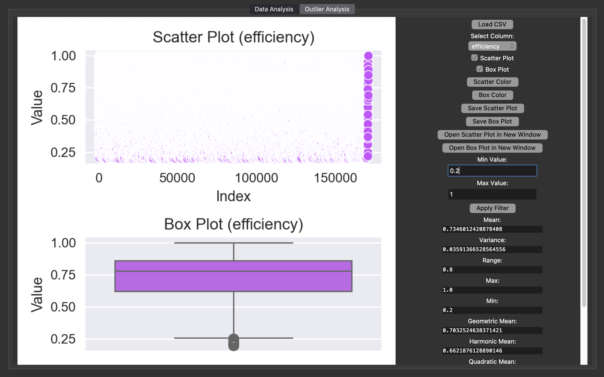

# PBDA
PBDA - Preliminary Big Data Analysis

## Data

Let's start with what is data? In our case, the data is presented as a table with a large number of variables. As my experience (and the previous dataset) tells me, in the end there were 20 variables and 170 thousand rows in the table. 

Preliminary analysis - everything you need to know about the data to set hypotheses and confirm them.

## The first tab of the program is an analysis of what is available

*design*

1) Difference graph with the ability to save (for a variable from the table by choice)
2) Box with whiskers with the ability to save (for a variable from the table by choice)
3) Arithmetic mean, dispersion, range, max value, min value, hyometric mean, harmonic mean, mean square, meldiana, standard deviation, mode (for a variable from the table by choice)

## The second tab of the program is emissions

![[hist]](hist.png)
*design*

1) filter the values, it looks something like this Variable name, maximum possible, minimum possible (by variable)
2)  Difference graph with the ability to save (for a variable from the table by choice)
3) Box with whiskers with the ability to save (for a variable from the table by choice)
4) Arithmetic mean, dispersion, range, max value, min value, hyometric mean, harmonic mean, mean square, meldiana, standard deviation, mode (for a variable from the table by choice)
